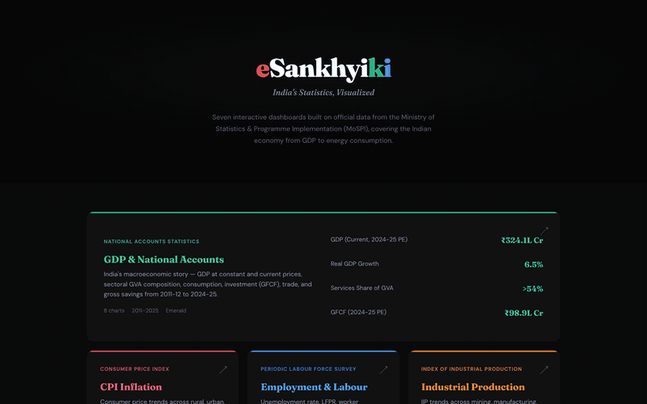

# eSankhyiki — India's Statistics, Visualized

Seven interactive dashboards built on official data from the Ministry of Statistics & Programme Implementation (MoSPI), covering the Indian economy from GDP to energy consumption.

**Live site:** [sagart-cactus.github.io/esankhyiki](https://sagart-cactus.github.io/esankhyiki/)

## Dashboards

| Dashboard | Data Source | Period | Charts |
|-----------|-----------|--------|--------|
| [GDP & National Accounts](https://sagart-cactus.github.io/esankhyiki/india-gdp-report/) | NAS | 2011–2025 | 8 |
| [CPI Inflation](https://sagart-cactus.github.io/esankhyiki/india-inflation-report/) | CPI | 2014–2025 | 10 |
| [Employment & Labour](https://sagart-cactus.github.io/esankhyiki/india-employment-report/) | PLFS | 2017–2024 | 8 |
| [Industrial Production](https://sagart-cactus.github.io/esankhyiki/india-industrial-report/) | IIP | 2012–2025 | 8 |
| [Factory Sector Survey](https://sagart-cactus.github.io/esankhyiki/india-factory-report/) | ASI | 2016–2024 | 8 |
| [Wholesale Prices](https://sagart-cactus.github.io/esankhyiki/india-wholesale-prices-report/) | WPI | 2013–2025 | 8 |
| [Energy Statistics](https://sagart-cactus.github.io/esankhyiki/india-energy-report/) | Energy Balance | 2012–2024 | 14 |

**68 charts. 7 dashboards. ~360KB total.**

## How It Was Built

NSO India released an [MCP Server](https://github.com/mospi-esankhyiki/esankhyiki-mcp) for eSankhyiki — enabling AI tools to connect directly to official statistical datasets through the Model Context Protocol.

These dashboards were built using that MCP server and [Claude](https://claude.ai). All data was fetched programmatically from the eSankhyiki API and hardcoded into self-contained HTML files — no backend, no build step, no runtime dependencies.

## Tech Stack

- **Chart.js** v4.4.7 with chartjs-plugin-datalabels
- **Fonts:** Fraunces (display) + DM Sans (body)
- **Theme:** Dark with per-dashboard accent colors
- **Animations:** Scroll-triggered reveals via IntersectionObserver
- **Responsive:** Breakpoints at 1024px, 700px, 480px

Each dashboard is a single `index.html` file (46–62KB) that works offline.

## Data Source

All data is sourced from the [Ministry of Statistics & Programme Implementation (MoSPI)](https://www.mospi.gov.in/) via the eSankhyiki API. Datasets include:

- **NAS** — National Accounts Statistics (GDP, GVA, consumption, investment, savings)
- **CPI** — Consumer Price Index (rural, urban, combined, group-wise, state-wise)
- **PLFS** — Periodic Labour Force Survey (unemployment, LFPR, WPR, wages)
- **IIP** — Index of Industrial Production (mining, manufacturing, electricity, use-based)
- **ASI** — Annual Survey of Industries (factory output, employment, profitability)
- **WPI** — Wholesale Price Index (primary articles, fuel, manufactured products)
- **Energy** — Energy Balance (supply, production, imports, sectoral consumption)

## License

MIT
